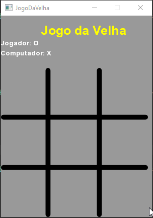

# Jogo da velha em Java com libGDX
Jogo da velha simples desenvolvido em Java utilizando o framework libGDX.

Assista aos vídeos!

### 01 - Configurando projeto e Renderizando Imagens

 
Canal no Youtube 

